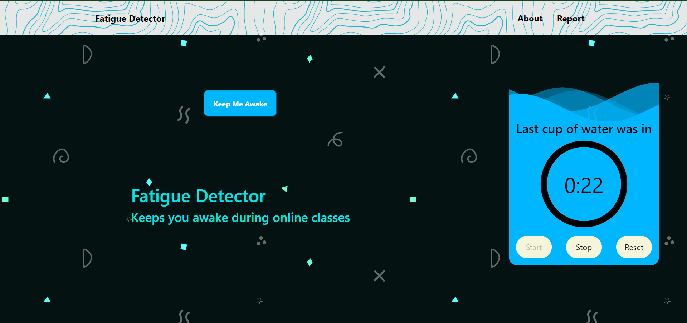
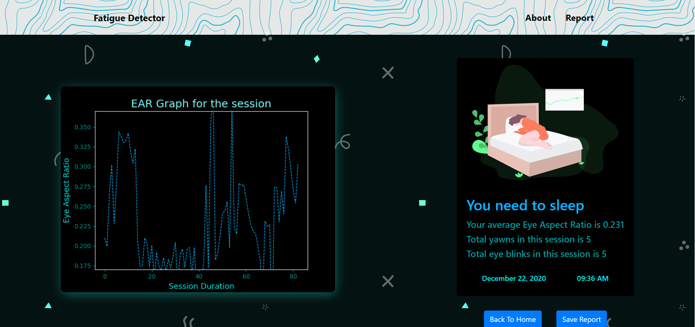
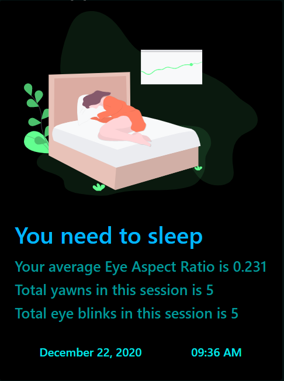
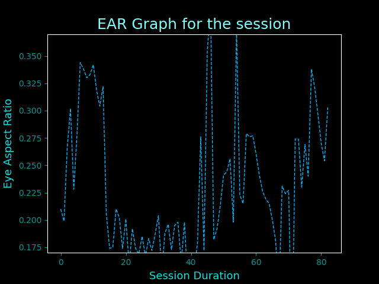
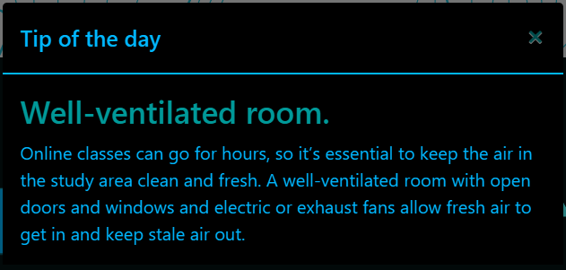

# FATIGUE-DETECTOR
<!-- ALL-CONTRIBUTORS-BADGE:START - Do not remove or modify this section -->
[](#contributors-)
<!-- ALL-CONTRIBUTORS-BADGE:END -->


## Clone the repo
```
git clone https://github.com/hhhrrrttt222111/fatigue-detector.git
cd fatigue-detector
```

## Installation
#### For windows
```
py -m pip install --upgrade pip
py -m pip install --user virtualenv
py -m venv env
.\env\Scripts\activate
py -m pip install -r requirements.txt
```
*OR*
```
py -m pip install --upgrade pip
py -m pip install --user virtualenv
py -m venv env
source env/Scripts/activate
py -m pip install -r requirements.txt
```
#### For MacOS & Linux
```
python3 -m pip install --user --upgrade pip
python3 -m pip install --user virtualenv
python3 -m venv env
source env/bin/activate
pip install -r requirements.txt
```

### Trouble installing dependencies ?

This project files requires **Python 3** and the following Python libraries installed:

- [OpenCV](https://opencv.org/)
- [dlib](https://github.com/davisking/dlib)
- [imutils](https://github.com/jrosebr1/imutils)
- [flask](https://flask.palletsprojects.com/en/1.1.x/)
- [scipy](https://www.scipy.org/)


[OpenCV](https://github.com/opencv/opencv) - [Mac](https://www.learnopencv.com/install-opencv3-on-macos/) | [Windows](https://www.learnopencv.com/install-opencv3-on-windows/) | [Ubuntu](https://www.learnopencv.com/install-opencv3-on-ubuntu/)


[Dlib](https://github.com/davisking/dlib) -   [Mac](https://www.learnopencv.com/install-dlib-on-macos/) | [Windows](https://medium.com/analytics-vidhya/how-to-install-dlib-library-for-python-in-windows-10-57348ba1117f) | [Ubuntu](https://www.pyimagesearch.com/2017/03/27/how-to-install-dlib/)


### Run

```
python app.py
```  

<br><br>


## Snapshots

 * ### Landing Page
<p align="center">
 
</p>
<br> 

 * ### Report Page
<p align="center">
 
</p>
<br> 

 * ### Generated Report
<p align="center">
 
</p>
<br> 

 * ### Generated EAR Graph
<p align="center">
 
</p>
<br> 

 * ### Tip of the day
<p align="center">
 
</p>

<br ><br ><br >

<br><br><br><br>

## Contributors ✨

Thanks goes to these wonderful people ([emoji key](https://allcontributors.org/docs/en/emoji-key)):

<!-- ALL-CONTRIBUTORS-LIST:START - Do not remove or modify this section -->
<!-- prettier-ignore-start -->
<!-- markdownlint-disable -->
<table>
  <tr>
    <td align="center"><a href="http://hhhrrrttt222111.me/"><br /><sub><b>Hemanth R</b></sub></a><br /><a href="https://github.com/hhhrrrttt222111/fatigue-detector/commits?author=hhhrrrttt222111" title="Code">💻</a> <a href="#design-hhhrrrttt222111" title="Design">🎨</a> <a href="#maintenance-hhhrrrttt222111" title="Maintenance">🚧</a></td>
    <td align="center"><a href="https://joeljosh.github.io"><br /><sub><b>Joel Joshua</b></sub></a><br /><a href="https://github.com/hhhrrrttt222111/fatigue-detector/commits?author=joeljosh" title="Code">💻</a> <a href="#design-joeljosh" title="Design">🎨</a> <a href="https://github.com/hhhrrrttt222111/fatigue-detector/pulls?q=is%3Apr+reviewed-by%3Ajoeljosh" title="Reviewed Pull Requests">👀</a></td>
  </tr>
</table>

<!-- markdownlint-enable -->
<!-- prettier-ignore-end -->
<!-- ALL-CONTRIBUTORS-LIST:END -->

